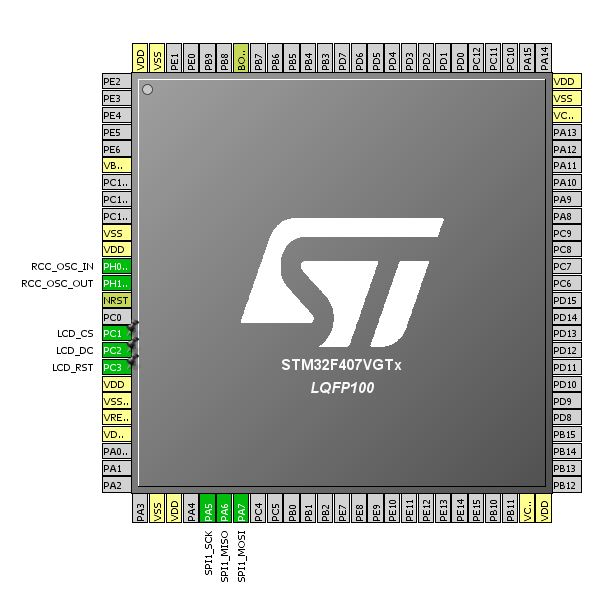

# STM32_HAL_ILI9341
ILI9341 Library for STM32 HAL

Tutorial

References
1. https://github.com/martnak/STM32-ILI9341
2. https://os.mbed.com/users/dreschpe/code/SPI_TFT_ILI9341/
3. https://www.mikroe.com/glcd-font-creator

Most of codes are originated from martnak's library. 
https://github.com/martnak/STM32-ILI9341

I wanted to make it support diverse fonts so I adopted character functions from SPI_TFT_ILI9341 library. 
As it supports C font array created by GLCD FONT Creator by MikroElektronika. 
https://www.mikroe.com/glcd-font-creator 

Please refer to the following link to get more details about fonts. 
https://os.mbed.com/users/dreschpe/code/SPI_TFT_ILI9341/ 

[ How to add new fonts ]
1. Run GLCD Font Creator
2. Click File-New Font-Import An Existing System Font
3. Select font, style and size from font dialog.
4. GLCD Font Cretor makes Bitmap fonts
5. Click Export for GLCD menu
6. Select mikroC tab.
7. Copy generated code to fonts.c file
8. Modify data type from unsigned short to uint8_t
9. Add optional bytes (offset, width, height, bpl) to the array !!! IMPORTANT !!!
10. Add extern declaration to fonts.h file

 

